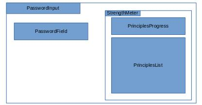

# Password strength meter

Password strength meter, built with [React](https://reactjs.org/) and [React Bootstrap](https://react-bootstrap.github.io/). Components can also be viewed with [Storybook](https://storybook.js.org/).

How to start:

    npm run start

opens up the application in `localhost:3000`

Checking the components:

    npm run storybook

Storybook with components is visible at `localhost:9001`

The components are in the `src` folder.

These components are part of the password strength meter project:
* PasswordInput
* PasswordField
* PrinciplesProgress
* PrinciplesList
* StrengthMeter

The structure is as follows:

Also these can be seen in Storybook, although they do not belong to the password strength meter project:
* Button
* Checkbox
* Form
* RadioButton

### Todo
- check that all conditions are met for the password
